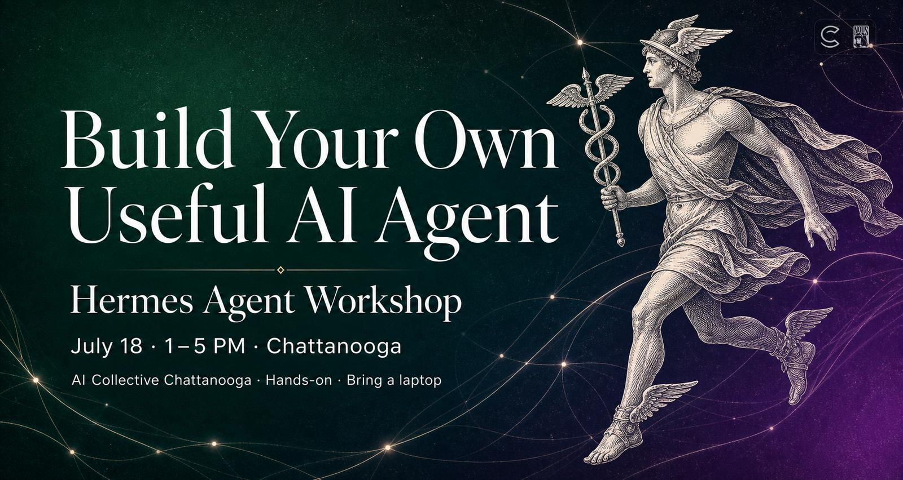
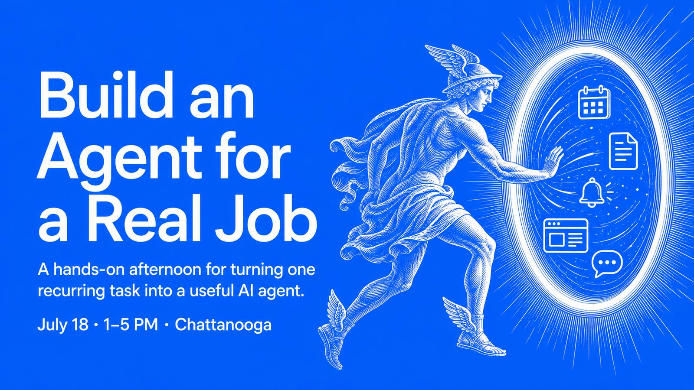

Build your own useful AI agent in one afternoon.

Agents are most powerful when they are pointed at a real job you actually have.

In this hands-on workshop, you'll learn what AI agents are good for, identify your own use case, build a working agent with Hermes on your laptop, connect it to the places where you already do your work, and set it up to talk to you and your team where you already work (Slack, Teams, Discord, Telegram, Signal, and more).

  <a href="https://luma.com/aic-ch-7-18" class="btn btn-primary" style="font-size: var(--text-lg); padding: var(--space-md) var(--space-2xl);">
    Register on Luma →
  </a>

## Who is this workshop for?

- You've never built an agent and want to learn
- You've got ideas about tasks you want to automate with agents but don't know where to start
- You've built dozens of agents and want to learn Hermes
- Anyone in between — business, builders, hobbyists, and curious beginners are welcome

## The Agenda

### Part 1 — Art of the Possible

We'll start with the mental model:

- What's an agent?
- Real-world use cases across work, life, ops, and research
- Why Hermes Agent by Nous Research?

### Part 2 — Use Case Brainstorm: Find a Real Problem

Agents are useful when they take over information work you already do by hand.

- **Self-improving regular briefings**: read newsletters, websites, events, releases, or updates and summarize only what matters
- **Alert triage and resolution**: automatically evaluate inbound issues, even automate resolution or escalation
- **Research tracking**: watch a topic, grant, policy, market, company, competitor, or project and report meaningful changes
- **Operations health**: inspect systems, dashboards, services, or recurring checks and report only what needs attention
- **Personal admin**: help track, manage, and schedule your events, appointments, renewals, reminders, purchases, travel, or recurring chores
- **Virtual employee**: train your agent to manage specific knowledge work tasks with browser and computer use automation
- And more!

### Part 3 — Setup Your Agent

We'll get Hermes running and configured:

- Install Hermes
- Connect a model/provider
- Configure tools, skills, MCP/connectors, and local context
- Chat where you already work: Discord, Telegram, Slack, Teams, email, or another target

### Part 4 — Make Your Agent Useful for You

This is the main build block. You'll pick a use case, bootstrap a Hermes skill, run it, inspect the result, and improve it through feedback.

We'll cover:

- Building your first agent around your chosen use case
- Teaching the agent to get sharper with each iteration
- Scheduling and delivery so the agent can run and message you where you already work

## What You'll Leave With

- Your own AI agent installed and working
- Connected to your messaging platform of choice
- One agent skill bootstrapped for something you actually care about
- A practical pattern you can reuse to build more agents later

## What to Bring

- **Laptop and charger**
- **Ideas for what to build** — we'll help you find a practical use case during the workshop

### Optional Pre-work

Get more out of the workshop by installing and configuring Hermes before you come. This will prevent you from losing time on snags.

<https://hermes.arcadian.cloud/pre-work>

## Location

**Technology Training Room**  
Business Development Center (BDC)  
100 Cherokee Blvd. Suite 100  
Chattanooga, TN 37405

  <a href="https://luma.com/aic-ch-7-18" class="btn btn-primary" style="font-size: var(--text-lg); padding: var(--space-md) var(--space-2xl);">
    Register on Luma →
  </a>

  Spaces are limited — grab your spot now.

