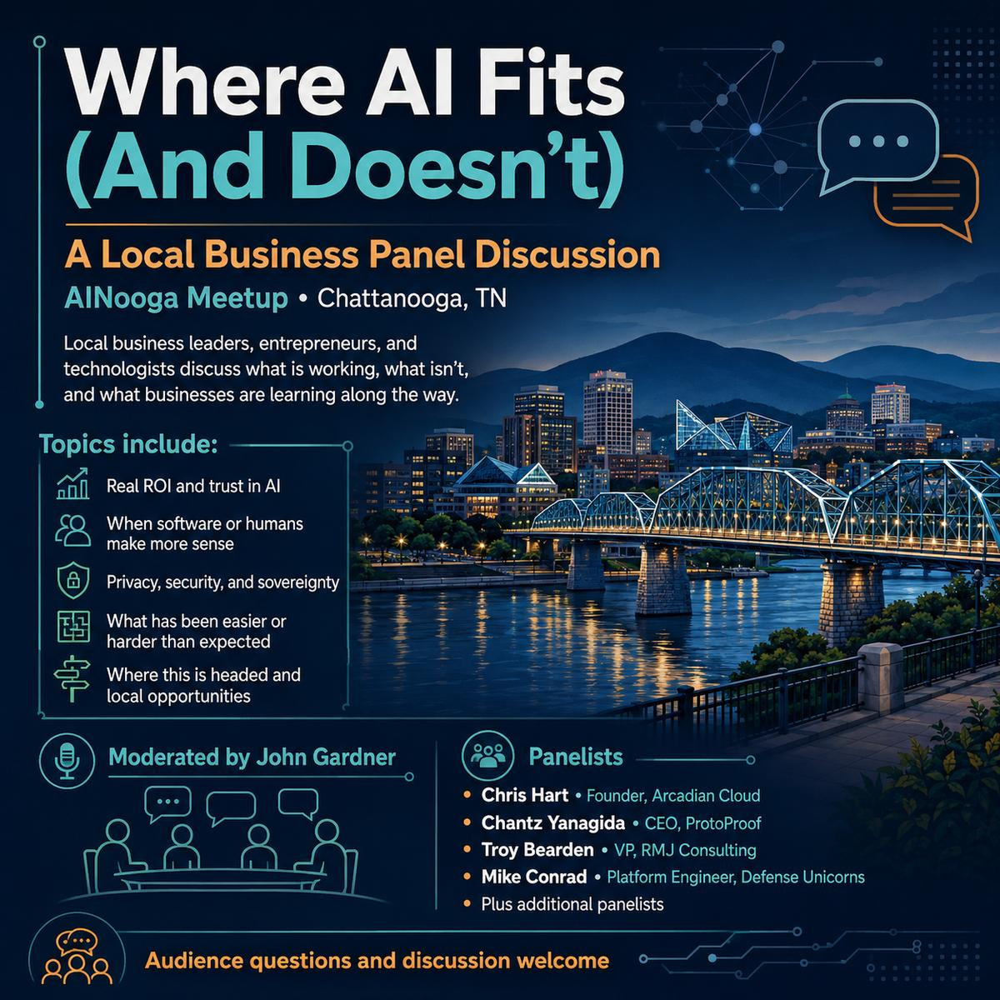

We are taking a break from workshops and history lessons this month to have a conversation. For this month's AINooga meetup, we're bringing together local business leaders, entrepreneurs, and technologists who are actually putting AI and other emerging technologies to work.

We'll talk about what is working, what isn't, and what businesses are learning along the way.

  <a href="https://luma.com/aic-ch-9-19" class="btn btn-primary" style="font-size: var(--text-lg); padding: var(--space-md) var(--space-2xl);">
    Register on Luma →
  </a>

## What We'll Talk About

- What's the real ROI (money, time, opportunity) of AI — and where is your balance point of trust right now?
- Where is traditional software, automation, or human expertise still making more sense?
- Concerns with data privacy, security, and sovereignty
- What has been easier — or harder — than expected?
- Where is this headed, and what local opportunities do you see in this new paradigm?

## The Panel

A discussion mediated by John Gardner, with panelists:

- **Chris Hart** — Founder, Arcadian Cloud
- **Chantz Yanagida** — CEO, ProtoProof
- **Troy Bearden** — Founder & Chief Engineer, Premsys.ai / Bytecove
- **Mike Conrad** — Platform Engineer, Defense Unicorns

_(more to be announced)_

We'll leave plenty of room for audience questions and discussion, so bring your own experiences, skepticism, successes, failures, and questions.

## Location

**[Chattanooga Business Development Center](https://maps.app.goo.gl/GfJhUMQDTvphEaQX7)** 
100 Cherokee Blvd.
Chattanooga, TN 37405

Regarding parking, please consult the graphic below:

---

The AI Collective is a global non-profit building the human layer for the AI era. We unite 200,000+ leaders, builders, and stakeholders across 100+ forums worldwide to democratize the frontier, build trust, and coordinate how society navigates the rapid acceleration of technological progress.

All attendees and organizers at events affiliated with The AI Collective agree to our privacy policy and are subject to our code of conduct.
