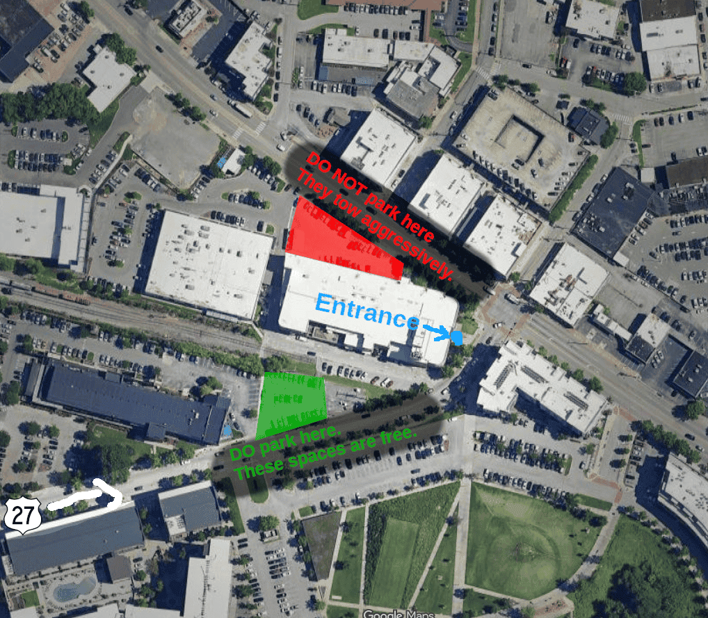

An agent can keep working between conversations or start a task on a schedule. How do you turn that into something useful in your own day?

This month, we'll explore Muse, Dots, and other ways to automate work with AI. We'll focus on the setup: giving an agent context and instructions, connecting your tools, and choosing what it can access.

  <a href="https://luma.com/auto-agents" class="btn btn-primary" style="font-size: var(--text-lg); padding: var(--space-md) var(--space-2xl);">
    Register on Luma →
  </a>

## What We'll Do

- Settle in with food and conversation for the first 15 minutes.
- Compare agent tools and explain containers, sandboxes, and permissions in plain language.
- Work through two automation ideas from the audience.
- Spend the remaining time setting up agents, experimenting, and helping each other.
- Make room for five-minute demos of things you've built.

The guided discussion and examples will take about an hour after we settle in. The rest of the afternoon is yours to try things out.

## What to Bring

A laptop, charger, and a task you'd like to automate. Already using an agent? Bring your setup and share what you've learned. You're also welcome to watch and ask questions, with no coding experience or laptop required.

## Location

**Business Development Center (BDC)** 
100 Cherokee Blvd., Suite 100 
Chattanooga, TN 37405

